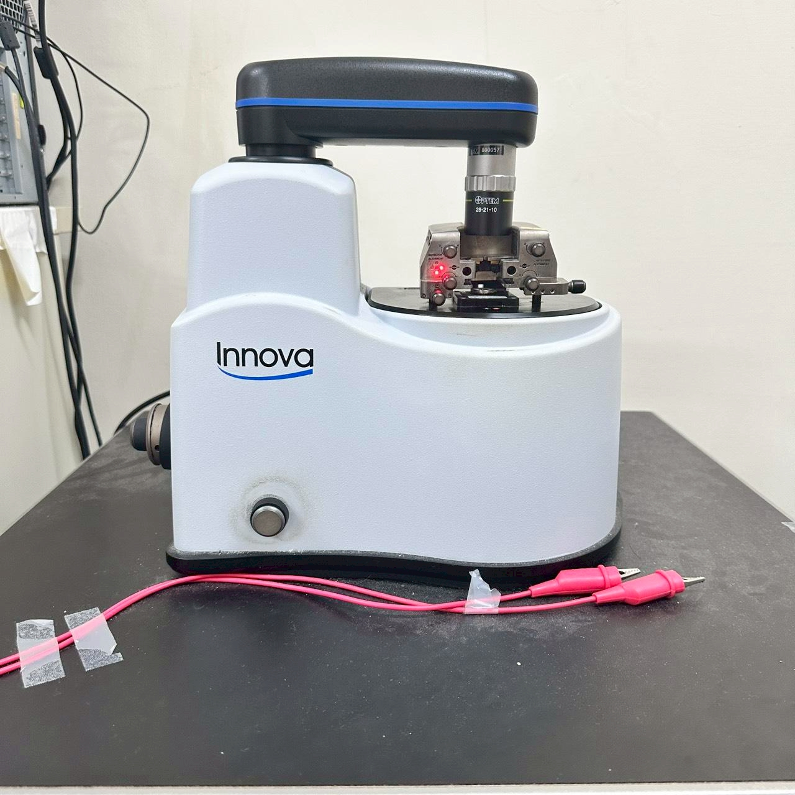

# NTNU WCLin Group Site — 中文編輯說明文件

本文件是 **NanoMaterials & Spintronics Laboratory / WCLin Group** 網站的中文維護說明，供後續不同成員協助更新網站內容時使用。

網站網址：

```text
https://wclin-group-c207.github.io/NTNU-WCLin-Group-Site/
```

本網站使用 **純 HTML + CSS + 少量 JavaScript** 建構，沒有使用 React、Vue、WordPress 或其他後端系統。每一頁都是獨立的 `.html` 檔案，可以直接在 GitHub 上編輯。

---

## 1. 網站整體架構

目前網站主要由以下檔案組成：

```text
NTNU-WCLin-Group-Site/
├── index.html                 # 首頁
├── group-leader.html          # 指導教授 / PI 頁面
├── members.html               # 實驗室成員與 Alumni
├── research.html              # 研究方向
├── publications.html          # 論文列表與搜尋篩選功能
├── facilities.html            # 實驗設備
├── exchange-awards.html       # 國際交流、獲獎與獎學金
├── gallery.html                # 相簿 / Gallery 頁面
├── assets/
│   └── images/
│       ├── skyrmion-hero.png  # 首頁主視覺背景圖
│       ├── Prof-Lin-photo.jpg
│       ├── Po-Wei.jpg
│       ├── Ko-Fan.jpeg
│       ├── AFM.jpg
│       ├── VSM.jpg
│       └── ...
└── README.md

---

## 2. 如何在 GitHub 上編輯網站

### 方法 A：直接在 GitHub 網頁上編輯

1. 打開 GitHub repository。
2. 點選要修改的檔案，例如：

```text
members.html
```

3. 點右上角鉛筆圖示。
4. 修改內容。
5. 拉到頁面最下方，找到 **Commit changes**。
6. 輸入簡短說明，例如：

```text
Update member profile
```

7. 點擊 **Commit changes**。
8. 等待約 1–5 分鐘。
9. 打開網站確認更新結果。

若網站沒有立刻更新，可以嘗試：

```text
Ctrl + F5
```

或使用無痕 / 私密瀏覽模式重新打開網站。

---

### 方法 B：上傳修改後的檔案

1. 在電腦上修改 `.html` 檔案。
2. 回到 GitHub repository。
3. 點選 **Add file → Upload files**。
4. 上傳修改後的檔案。
5. 確認檔名完全相同，例如仍為：

```text
index.html
```

6. Commit changes。
7. 等待 GitHub Pages 更新。

---

## 3. 全站設計系統

每一頁的 `<style>` 區塊通常都會有以下 CSS 變數：

```css
:root {
  --color-ink:       #1a2238;
  --color-accent:    #a82740;
  --color-cream:     #faf7f0;
  --color-paper:     #ffffff;
  --color-rule:      #e4dfd0;
  --color-muted:     #6b7280;
  --color-soft:      #f0ebdc;

  --font-display: 'Fraunces', 'Noto Serif TC', Georgia, serif;
  --font-body:    Arial, 'Noto Sans TC', -apple-system, BlinkMacSystemFont, sans-serif;

  --max-width: 1240px;
  --gutter: clamp(20px, 4vw, 48px);
}
```

### 目前網站主視覺方向

| 項目 | 設定 |
|---|---|
| 主色 | 深藍墨色 `#1a2238` |
| 強調色 | 深紅色 `#a82740` |
| 背景 | 米白色 `#faf7f0` |
| 標題字體 | Fraunces |
| 內文字體 | Arial + Noto Sans TC |
| 風格 | 學術編輯感、期刊風、Nature / MIT 類型 |

### 不建議加入的元素

請避免加入：

- 高飽和紫色漸層
- 過多 emoji
- 大量圓角卡片
- 很重的陰影
- 太多不一致的顏色
- SaaS / startup 風格按鈕
- 與整體風格不符的 AI 圖示感

網站目前目標不是商業 landing page，而是「學術實驗室網站 + 期刊編輯感」。

---

## 4. 導覽列 Nav

每個頁面都有類似以下的導覽列：

```html
<nav class="nav">
  <div class="nav-inner">
    <a href="index.html" class="nav-brand">WCLin Group</a>
    <button class="nav-toggle" aria-label="Menu" onclick="document.getElementById('navLinks').classList.toggle('open')">☰</button>
    <ul class="nav-links" id="navLinks">
      <li><a href="index.html">Home</a></li>
      <li><a href="group-leader.html">Group Leader</a></li>
      <li><a href="members.html">Members</a></li>
      <li><a href="research.html">Research</a></li>
      <li><a href="publications.html">Publications</a></li>
      <li><a href="facilities.html">Facilities</a></li>
      <li><a href="exchange-awards.html">Awards</a></li>
      <li><a href="photos.html">Gallery</a></li>
    </ul>
  </div>
</nav>
```

### 修改導覽列時要注意

如果新增、刪除、改名或調整順序，請同步修改所有頁面的導覽列。

每一頁只有當前頁面的連結要加上：

```html
class="active"
```

例如在 Publications 頁：

```html
<a href="publications.html" class="active">Publications</a>
```

其他頁面的對應項目則不要有 `active`。

---

## 5. 頁尾 Footer

頁尾通常長這樣：

```html
<footer class="footer">
  ...
</footer>
```

如果修改以下內容，請同步更新所有頁面：

- 實驗室地址
- 教授 email
- Office / Lab 電話
- Fax
- copyright 年份
- Designed by 文字
- 外部連結

目前 footer 內的設計者資訊可寫成：

```html
Designed by Ko-Fan Chen &amp; Po-Wei Chen · Rebuilt 2026
```

---

## 6. 首頁 `index.html`

首頁主要包含：

1. 導覽列
2. Hero 首頁主視覺
3. Research Focus 四個研究方向
4. Lab News 近期消息
5. Join Us CTA
6. Footer

---

### 6.1 首頁 Hero 背景圖

首頁主視覺背景圖位於：

```text
assets/images/skyrmion-hero.png
```

CSS 中通常寫成：

```css
background-image:
  linear-gradient(...),
  radial-gradient(...),
  radial-gradient(...),
  linear-gradient(...),
  url("assets/images/skyrmion-hero.png");
```

這裡不是單純一張圖片，而是多層背景疊在一起。

### 背景層的概念

通常包含：

1. 橫向米白霧化
2. 右上角 radial 霧化
3. 左下角 radial 霧化
4. 上下方向霧化
5. 真正的背景圖片

在 CSS 中，越前面的 background layer 越靠上。

---

### 6.2 新增 radial-gradient

如果想多加一個局部霧化區域，不是加進同一個 `radial-gradient()` 裡，而是新增一層：

```css
background-image:
  linear-gradient(...),
  radial-gradient(circle at 88% 12%, ...),
  radial-gradient(circle at 12% 88%, ...),
  radial-gradient(circle at 50% 50%, ...), /* 新增的一層 */
  linear-gradient(...),
  url("assets/images/skyrmion-hero.png");
```

新增背景層後，也建議同步增加：

```css
background-size
background-position
background-repeat
```

例如六層背景：

```css
background-size:
  100% 100%,
  100% 100%,
  100% 100%,
  100% 100%,
  100% 100%,
  cover;

background-position:
  center center,
  center center,
  center center,
  center center,
  center center,
  center center;

background-repeat:
  no-repeat,
  no-repeat,
  no-repeat,
  no-repeat,
  no-repeat,
  no-repeat;
```

如果層數不一致，可能會出現奇怪的矩形霧化、圖片錯位或背景重複。

---

### 6.3 Hero 文字修改

首頁主要標題位於：

```html
<header class="hero">
  <div class="hero-mark">
    <strong>EST. 2007</strong><br>
    Department of Physics<br>
    National Taiwan Normal University<br>
    Taipei · Taiwan
  </div>

  <div class="hero-label"> Magnetic thin films, 2D materials, and spin transport</div>

  <h1 class="hero-title">
    NanoMaterials &amp;<br>
    <em>Spintronics Laboratory</em>
  </h1>

  <p class="hero-lead">
    ...
  </p>

  <a class="hero-cta" href="research.html">Explore our research <span aria-hidden="true">→</span></a>
</header>
```

可修改：

- `hero-mark`：右上角 EST. 2007 小文字
- `hero-label`：紅色小標
- `hero-title`：大標題
- `hero-title em`：紅色斜體部分
- `hero-lead`：下方說明文字
- `hero-cta`：按鈕文字與連結

---

### 6.4 Hero 字體粗細

若要調整首頁 hero 文字粗細，可改：

```css
.hero-label {
  font-weight: 600;
}
```

```css
.hero-title {
  font-weight: 400;
}
```

```css
.hero-title em {
  font-weight: 300;
}
```

```css
.hero-lead {
  font-weight: 500;
}
```

建議範圍：

| 區塊 | 建議範圍 |
|---|---|
| `.hero-label` | `600–700` |
| `.hero-title` | `400–500` |
| `.hero-title em` | `300–400` |
| `.hero-lead` | `400–500` |

Fraunces 字體若過粗會變得笨重，因此大標題不要輕易調到 `700`。

---

### 6.5 手機版 Hero

手機版樣式在：

```css
@media (max-width: 720px) {
  ...
}
```

如果手機版背景太花，不建議一直只調 `.hero::after`。更好的方法是在手機版重新定義 `.hero` 的 `background-image`，讓手機不要繼承桌機版的多層背景。

範例：

```css
@media (max-width: 720px) {
  .hero {
    background-image:
      linear-gradient(...),
      linear-gradient(...),
      url("assets/images/skyrmion-hero.png");
  }

  .hero::after {
    display: none;
  }
}
```

手機版原則：

```text
文字清楚 > 圖片細節
```

桌機可以保留漂亮背景，手機版則應讓圖片退成氛圍背景。

---

### 6.6 Research Focus 卡片

首頁四個研究方向在：

```html
<div class="research-grid">

  <article class="research-card">
    <div class="research-num">01</div>
    <h3>Hydrogen-Tunable Magnetism</h3>
    <p>...</p>
  </article>

</div>
```

新增卡片方式：

1. 複製一整段 `<article class="research-card">...</article>`
2. 修改編號
3. 修改標題
4. 修改描述
5. 確認手機版排版正常

---

### 6.7 Lab News 更新

首頁新聞以年份分組：

```html
<div class="news-year">
  <div class="news-year-label">2026</div>
  <div class="news-items">

    <div class="news-item">
      <span class="news-tag admission">ADMISSION</span>
      <p class="news-text">...</p>
    </div>

  </div>
</div>
```

新增新聞：

1. 找到正確年份
2. 複製一段 `.news-item`
3. 修改標籤與文字

常見 tag：

```html
<span class="news-tag admission">ADMISSION</span>
<span class="news-tag intl">EXCHANGE</span>
<span class="news-tag award">AWARD</span>
<span class="news-tag paper">PAPER</span>
```

若新增新的類型，例如 `seminar`，需在 CSS 中加入：

```css
.news-tag.seminar { color: #xxxxxx; }
```

---

## 7. Group Leader 頁 `group-leader.html`

此頁通常包含：

- page header
- 教授照片
- 個人資料
- 學歷
- 經歷
- 研究興趣
- footer

### 更新教授照片

常見寫法：

```html

```

更換照片：

1. 將新照片上傳至 `assets/images/`
2. 建議檔名：

```text
Prof-Lin-photo.jpg
```

3. 若檔名不同，更新 `src`

避免使用：

```text
教授照片.jpg
Prof Lin final copy (1).png
```

建議使用英文、數字、連字號。

---

## 8. Members 頁 `members.html`

成員頁由重複的 member card 組成。

典型結構：

```html
<article class="member">
  <div class="member-photo">
    
    <span class="member-badge">D3</span>
  </div>

  <div>
    <h3 class="member-name">
      陳柏維<span class="member-name-en">Po-Wei Chen</span>
    </h3>

    <ul class="member-edu">
      <li>B.S. Physics, NTNU (2023)</li>
      <li>Ph.D. Physics (Dual-Degree), UOsaka &amp; NTNU (2024 – Present)</li>
    </ul>

    <p class="member-contact">
      <span class="contact-label">Contact</span><br>
      <a href="mailto:example@email.edu">example@email.edu</a>
    </p>
  </div>
</article>
```

### 新增成員

1. 複製一整段 `<article class="member">...</article>`
2. 修改：
   - 照片路徑
   - alt 文字
   - badge，例如 D3、M2、B4
   - 中文姓名
   - 英文姓名
   - 學歷列表
   - email

### 成員照片建議

```text
比例：4:5
寬度：800–1200 px
格式：jpg / jpeg / png
檔名：英文、數字、連字號
```

好的檔名：

```text
Po-Wei.jpg
Ko-Fan.jpeg
Ming-Hsien.png
```

不建議：

```text
陳柏維照片.jpg
IMG_1234 copy final.png
Po Wei 2026 (1).jpg
```

### Contact 標籤

若想顯示：

```text
Contact
email@example.edu
```

建議 HTML：

```html
<p class="member-contact">
  <span class="contact-label">Contact</span><br>
  <a href="mailto:email@example.edu">email@example.edu</a>
</p>
```

CSS：

```css
.contact-label {
  color: var(--color-ink);
  font-weight: 600;
}

.member-contact a {
  color: var(--color-accent);
  font-weight: 400;
}
```

### 常見 spacing 調整

英文姓名與學歷間距：

```css
.member-name-en {
  margin-bottom: 6px;
}
```

學歷區塊若把 Contact 推太遠，檢查：

```css
.member-edu {
  min-height: 0;
}
```

Contact 與學歷間距：

```css
.member-contact {
  margin-top: 0;
}
```

---

## 9. Research 頁 `research.html`

Research 頁包含：

- page header
- TOC / anchor buttons
- topic blocks

典型研究主題區塊：

```html
<section class="topic" id="hydrogen">
  <div class="topic-head">
    <div class="topic-num">01</div>
    <div>
      <div class="topic-kicker">Hydrogen-Tunable Magnetism</div>
      <h2 class="topic-title">...</h2>
    </div>
  </div>

  <div class="topic-body">
    ...
  </div>
</section>
```

### 新增研究主題

1. 複製一整段 `<section class="topic">...</section>`
2. 設定新的 `id`
3. 在 `.toc` 加上對應連結
4. 修改編號、標題、摘要、關鍵字與內容

TOC 範例：

```html
<a href="#new-topic">New Topic</a>
```

section 範例：

```html
<section class="topic" id="new-topic">
```

`href` 與 `id` 必須一致。

---

## 10. Publications 頁 `publications.html`

Publications 頁是網站中資料量最大的頁面，通常包含：

- 統計卡片
- 搜尋欄
- 年份篩選
- 排序選單
- JavaScript 自動產生的 publication list

### 常見區塊

統計：

```html
<div class="stats">
  ...
</div>
```

搜尋 / 篩選：

```html
<div class="controls">
  ...
</div>
```

論文列表容器：

```html
<ul class="pub-list" id="pubList"></ul>
```

論文資料通常在 JavaScript array 中，例如：

```js
const publications = [
  {
    year: 2026,
    title: "...",
    authors: "...",
    journal: "...",
    volume: "...",
    url: "...",
    thumbnail: "",
    roles: ["CORRESP."]
  },
  ...
];
```

### 新增論文

在 publication array 中新增一筆 object：

```js
{
  year: 2026,
  title: "Full paper title here",
  authors: "Author A, Author B, Author C, W. C. Lin",
  journal: "Journal Name",
  volume: "12, 123–130",
  url: "https://doi.org/...",
  thumbnail: "",
  roles: ["CORRESP."]
}
```

### 論文格式

建議採接近 Nature 的資訊順序：

```text
Authors. Title. Journal volume, pages (year).
```

目前網站是將作者、題名、期刊、年份等欄位拆開存放，因此新增時要保持格式一致。

### Thumbnail 顯示

如果：

```js
thumbnail: ""
```

通常會顯示年份縮圖。

如果：

```js
thumbnail: "assets/images/p001.jpg"
```

則會顯示指定圖片。

### 統計數字

若頁面中的總篇數、年份範圍、h-index 等數字不是自動計算，新增論文後需手動更新統計卡片。

---

## 11. Facilities 頁 `facilities.html`

Facilities 頁以卡片顯示設備。

典型結構：

```html
<article class="facility">
  <div class="facility-photo">
    
  </div>
  <div class="facility-body">
    <div class="facility-num">01</div>
    <h3>Atomic Force Microscope</h3>
    <p>...</p>
  </div>
</article>
```

### 新增設備

1. 將設備照片上傳到 `assets/images/`
2. 複製一段 `.facility`
3. 修改：
   - 圖片路徑
   - alt
   - 編號
   - 設備名稱
   - 描述文字

建議圖片比例：

```text
4:3
```

---

## 12. Awards & Exchange 頁 `exchange-awards.html`

此頁使用 tabs 與 timeline。

典型 timeline item：

```html
<div class="tl-item">
  <span class="tl-tag phd">PHD</span>
  <p class="tl-text">...</p>
</div>
```

### 新增紀錄

1. 找到正確 tab
2. 找到正確年份
3. 複製一段 `.tl-item`
4. 修改 tag 與文字

常見 tag：

```html
<span class="tl-tag phd">PHD</span>
<span class="tl-tag msc">MSC</span>
<span class="tl-tag bsc">BSC</span>
<span class="tl-tag postdoc">POSTDOC</span>
```

若新增新 tag 類型，需要新增 CSS：

```css
.tl-tag.newtag { color: #xxxxxx; }
```

---

## 13. Gallery 頁

相簿頁通常由 photo sections 與 photo grids 組成。

典型結構：

```html
<section class="gallery-section" id="2026">
  <div class="section-head">
    <span class="section-num">01</span>
    <h2 class="section-title">2026</h2>
    <span class="section-meta">...</span>
  </div>

  <div class="photo-grid">
    <article class="photo-card">
      
    </article>
  </div>
</section>
```

### 新增照片

1. 將照片上傳到：

```text
assets/images/
```

2. 新增一段 `.photo-card`
3. 修改圖片路徑
4. 填寫有意義的 alt 文字

推薦檔名：

```text
lab-meeting-2026-01.jpg
conference-osaka-2026.jpg
```

---

## 14. 圖片路徑與命名規則

HTML 圖片路徑：

```html

```

CSS 背景圖片：

```css
background-image: url("assets/images/skyrmion-hero.png");
```

### GitHub Pages 大小寫規則

以下三個是不同檔案：

```text
Po-Wei.jpg
po-wei.jpg
Po-Wei.JPG
```

若圖片無法顯示，請檢查：

1. 檔名是否完全一致
2. 副檔名是否一致
3. 大小寫是否一致
4. 是否真的在 `assets/images/`
5. 是否已 commit
6. 是否因瀏覽器快取尚未更新

可以直接測試圖片網址：

```text
https://wclin-group-c207.github.io/NTNU-WCLin-Group-Site/assets/images/IMAGE_NAME
```

如果圖片網址打得開，但網頁中不顯示，通常是 HTML/CSS 路徑寫錯。

---

## 15. 手機版與 RWD

網站使用 media query：

```css
@media (max-width: 960px) {
  ...
}
```

```css
@media (max-width: 720px) {
  ...
}
```

```css
@media (max-width: 420px) {
  ...
}
```

### 常見斷點

| 斷點 | 用途 |
|---|---|
| `960px` | 導覽列切換為漢堡選單 |
| `720px` | 主要手機版排版 |
| `600px` | 小型內容 grid |
| `420px` | 非常窄的手機畫面 |

### 建議測試尺寸

修改後請至少測：

```text
390px
430px
768px
1024px
1440px
```

---

## 16. 常見錯誤與排查

### 圖片不顯示

檢查：

```text
檔名
副檔名
大小寫
資料夾路徑
是否 commit
瀏覽器快取
```

### 導覽列連結 404

檢查：

```html
<a href="photos.html">Gallery</a>
```

是否真的有：

```text
photos.html
```

### 手機版 menu 打不開

確認 button：

```html
<button class="nav-toggle" onclick="document.getElementById('navLinks').classList.toggle('open')">☰</button>
```

和 menu：

```html
<ul class="nav-links" id="navLinks">
```

`id="navLinks"` 必須完全一致。

### CSS 改了沒反應

可能原因：

1. 瀏覽器快取
2. 後面有同名 selector 覆蓋
3. 寫在 media query 裡，只在特定寬度生效
4. `{}` 括號錯誤
5. CSS 層數與背景層數不一致

### 版面突然跑掉

優先檢查：

```text
少一個 }
多一個 }
註解 /* ... */ 沒有關閉
background-image 少逗號
background-size 層數不對
background-position 層數不對
HTML tag 沒有關閉
```

---

## 17. 編輯原則

### 建議做法

- 一次只改一個區塊
- 改完立即測試
- 圖片檔名使用英文與連字號
- 色彩維持在既有設計系統內
- 導覽列與 footer 保持全站一致
- 新增內容時複製既有 block 再修改

### 不建議做法

- 改檔名但不更新連結
- 使用中文檔名或空白檔名
- 同時大量修改桌機與手機版 CSS
- 混用太多字體
- 新增過多強烈色彩
- 留下無效 CSS 片段
- 不測試手機版就 commit

---

## 18. 上線前檢查表

每次更新前建議檢查：

```text
[ ] 首頁桌機版正常
[ ] 首頁手機版正常
[ ] 導覽列所有連結正常
[ ] 手機漢堡選單可打開
[ ] 圖片全部顯示
[ ] Members 頁沒有破版
[ ] Publications 搜尋 / 篩選正常
[ ] Gallery 檔名與導覽列一致
[ ] Footer 資訊正確
[ ] GitHub commit message 清楚
```

建議 commit message：

```text
Update member profiles
Add 2026 publications
Fix mobile hero layout
Update facilities photos
Revise gallery page
```

---

## 19. 未來維護建議

目前網站 CSS 寫在各自 HTML 檔案中。這樣適合直接編輯，但缺點是全站共用樣式需要同步修改多個檔案。

未來若要長期維護，可以考慮整理成：

```text
assets/css/style.css
```

然後每頁只引用：

```html
<link rel="stylesheet" href="assets/css/style.css">
```

這樣修改顏色、字體、導覽列樣式時只需要改一個 CSS 檔案。

但在尚未重構前，請記得：

```text
導覽列改動 → 每一頁都要改
footer 改動 → 每一頁都要改
全站顏色 / 字體改動 → 每一頁都要改
```

---

## 20. 快速參考

### 主要頁面

```text
index.html
group-leader.html
members.html
research.html
publications.html
facilities.html
exchange-awards.html
gallery.html
```

### 圖片資料夾

```text
assets/images/
```

### 主要顏色

```css
--color-ink:    #1a2238;
--color-accent: #a82740;
--color-cream:  #faf7f0;
```

### 主要字體

```css
--font-display: Fraunces;
--font-body: Arial, Noto Sans TC;
```

### 網站網址

```text
https://wclin-group-c207.github.io/NTNU-WCLin-Group-Site/
```
